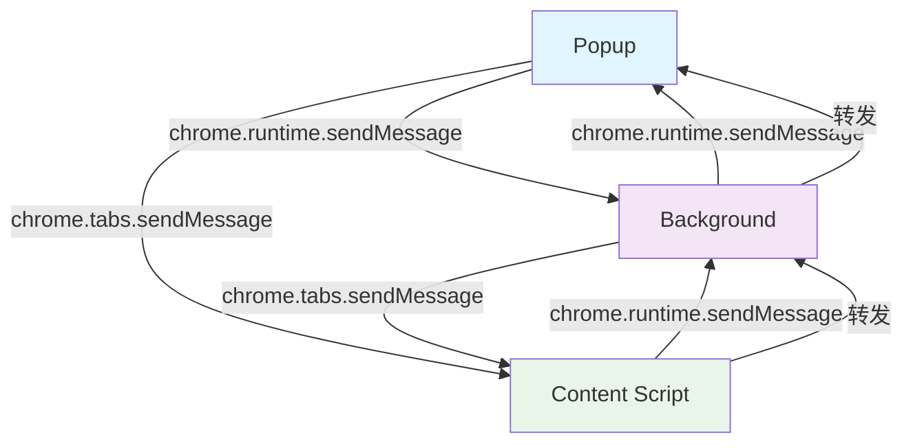

# Twitter Cleaner 消息传递架构

## 概述

Twitter Cleaner 扩展使用明确的单向消息传递架构来确保各组件间的清晰通信。本架构遵循 Chrome Extension 的最佳实践，保持组件间的良好解耦，每个通信链路都是单向的，职责明确。

## 消息传递模式

### 1. Popup → Background（单向通信）

- **机制**：`chrome.runtime.sendMessage()`
- **用途**：发送控制指令、配置管理请求
- **特点**：Popup 主动向 Background 发送消息

### 2. Background → Popup（单向通信）

- **机制**：`chrome.runtime.sendMessage()`
- **用途**：响应 Popup 的请求、推送状态更新
- **特点**：Background 主动向 Popup 发送消息

### 3. Popup → Content（单向通信）

- **机制**：`chrome.tabs.sendMessage()`
- **用途**：发送控制指令（开始/停止清理、重置进度等）
- **特点**：Popup 主动向当前活动标签页的 Content Script 发送消息

### 4. Content → Background（单向通信）

- **机制**：`chrome.runtime.sendMessage()`
- **用途**：报告进度更新、发送日志信息
- **特点**：Content Script 主动向 Background 发送消息

### 5. Background → Content（单向通信）

- **机制**：`chrome.tabs.sendMessage()`
- **用途**：响应 Content 的请求（较少使用）
- **特点**：Background 主动向 Content Script 发送消息

### 6. Content → Popup（间接单向通信）

- **机制**：Content → Background → Popup

## 消息流向图



## 具体实现

### 消息类型定义

所有消息类型都在 `src/utils/message-types.js` 中定义，明确标识：

- 消息用途
- 发送方
- 接收方

### 消息处理器

每个组件都使用 `setupMessageHandlers()` 方法注册消息处理器，确保：

- 消息处理逻辑集中管理
- 统一的响应格式 `{ success: true }`
- 清晰的职责分离

## 设计优势

1. **职责分离**：各组件有明确的通信职责
2. **解耦设计**：Content Script 不直接与 Popup 通信
3. **可扩展性**：易于添加新的消息类型和处理逻辑
4. **可维护性**：清晰的消息流向便于调试和维护
5. **性能优化**：避免不必要的消息广播

## 最佳实践

1. **使用常量定义消息类型**：避免拼写错误，便于维护
2. **明确消息流向**：每个消息都有明确的发送方和接收方
3. **统一响应格式**：所有消息处理器返回标准格式的响应
4. **错误处理**：妥善处理消息传递和处理过程中的错误
5. **文档化**：为每个消息类型添加详细的注释说明

## 常见消息流链示例

### 清理过程控制

```
Popup → Content: START_CLEANING
Content → Background: CONTENT_PROGRESS_UPDATE
Background → Popup: POPUP_PROGRESS_UPDATE
```

### 配置管理

```
Popup → Background: GET_CONFIG
Popup → Background: SAVE_CONFIG
```

这种架构确保了扩展的稳定性和可维护性，同时提供了良好的用户体验。

