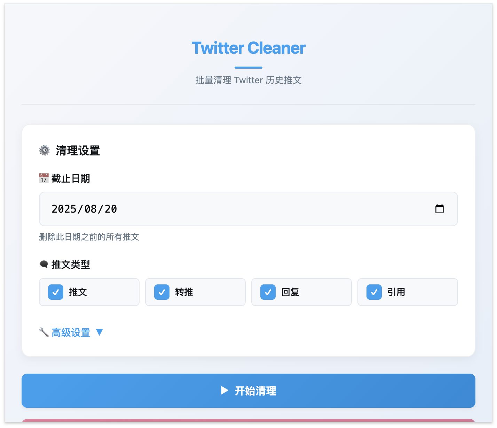
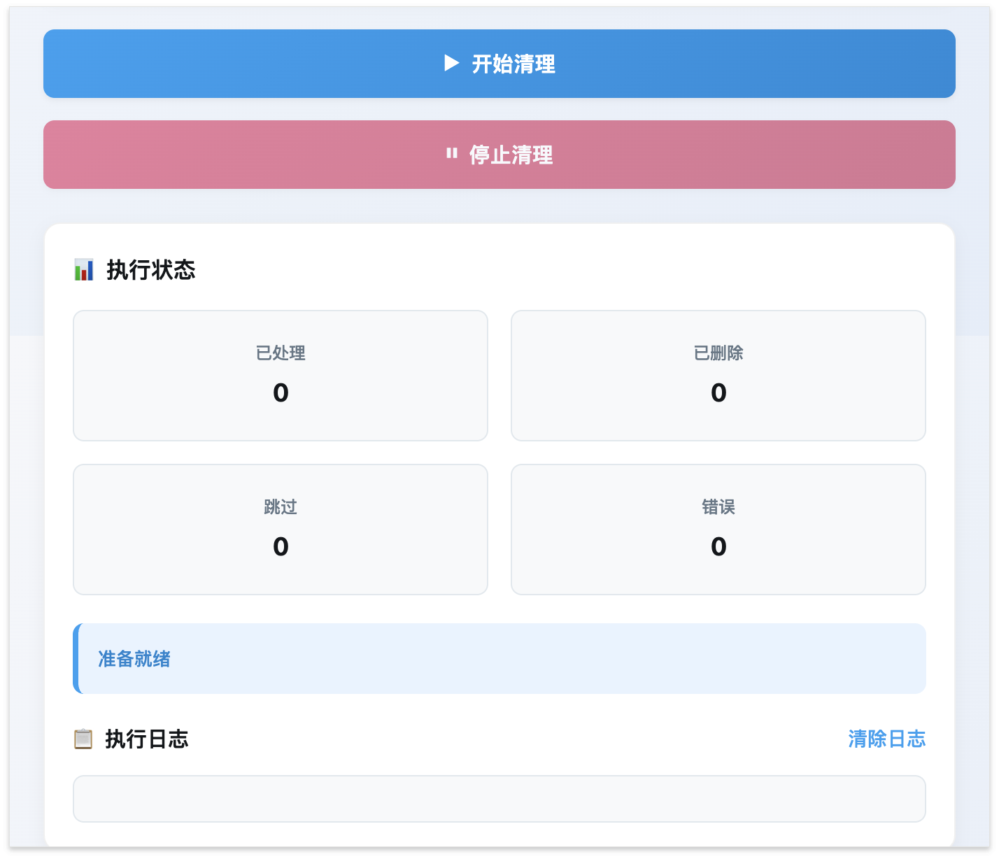

# 🐦 Twitter Cleaner

> 批量清理 Twitter 历史推文的 Chrome 扩展程序

[](https://opensource.org/licenses/MIT)
[](https://chrome.google.com/webstore)
[](https://github.com/yourusername/twitter-cleaner)

## 📖 产品简介

Twitter Cleaner 是一个强大的 Chrome 扩展程序，帮助用户批量删除 Twitter（现 X）账户中的历史推文。无论你是想清理旧内容、保护隐私，还是重新开始，这个工具都能让你轻松管理你的 Twitter 历史记录。

### ✨ 主要特性

- 🚀 **批量删除** - 一次性删除大量历史推文
- 🎯 **精确筛选** - 按日期、类型筛选要删除的推文
- ⚡ **智能操作** - 自动滚动和检测推文
- 🛡️ **安全可靠** - 本地处理，不上传任何数据
- 🎨 **用户友好** - 直观的界面和实时进度显示
- ⚙️ **高度可配置** - 自定义删除间隔和滚动速度

### 🖼️ 界面预览

#### 主界面


#### 状态监控


## 🚀 快速开始

### 系统要求

- Google Chrome 88+ 或基于 Chromium 的浏览器
- Node.js 14+ （用于开发构建）
- 有效的 Twitter 账户

### 📦 安装方法

#### 方法一：开发者模式安装（推荐）

1. **克隆项目**
   ```bash
   git clone https://github.com/yourusername/twitter-cleaner.git
   cd twitter-cleaner
   ```

2. **安装依赖**
   ```bash
   npm install
   ```

3. **构建项目**
   ```bash
   npm run build
   ```

4. **加载到 Chrome**
   - 打开 Chrome 浏览器
   - 访问 `chrome://extensions/`
   - 启用右上角的"开发者模式"
   - 点击"加载已解压的扩展程序"
   - 选择项目的 `dist` 目录

#### 方法二：打包安装

1. **创建安装包**
   ```bash
   npm run package
   ```

2. **解压并安装**
   - 解压生成的 `twitter-cleaner-v1.0.0.zip` 文件
   - 按照方法一的步骤 4 进行安装

### 🎯 使用指南

#### 基本使用

1. **登录 Twitter**
   - 访问 [twitter.com](https://twitter.com) 或 [x.com](https://x.com)
   - 登录你的 Twitter 账户

2. **启动扩展**
   - 点击浏览器右上角的 Twitter Cleaner 图标
   - 扩展控制面板将弹出

3. **配置设置**
   - **截止日期**：选择要删除的推文的截止日期
   - **推文类型**：选择要删除的推文类型
     - 推文（Tweets）
     - 转推（Retweets）
     - 回复（Replies）
     - 引用（Quote Tweets）
   - **高级设置**：调整删除间隔、滚动间隔等参数

4. **开始清理**
   - 点击"开始清理"按钮
   - 扩展会自动开始扫描和删除推文
   - 实时查看进度和统计信息

5. **监控进度**
   - 在弹窗中查看处理统计
   - 观察实时日志输出
   - 可随时点击"停止清理"暂停操作

#### 高级配置

| 设置项 | 说明 | 推荐值 |
|--------|------|--------|
| 删除间隔 | 每次删除操作之间的延迟 | 2000-3000ms |
| 滚动间隔 | 页面滚动后的等待时间 | 1000-2000ms |
| 最大处理数量 | 限制一次处理的推文数量 | 100-500 |
| 调试模式 | 启用详细日志输出 | 根据需要 |

## ⚠️ 重要提醒

### 安全注意事项
- 🔒 **本地处理**：所有操作都在本地完成，不会上传任何数据到外部服务器
- 🧪 **测试建议**：建议先在小范围内测试，确认无误后再大规模使用
- ⚠️ **不可逆操作**：删除操作不可逆转，请谨慎操作

### 使用建议
- 🐌 **慢速开始**：首次使用建议设置较长的删除间隔（3000ms 以上）
- 📅 **分批处理**：可以先删除较旧的推文进行测试
- 💾 **备份重要内容**：定期保存你的重要推文内容

## 🔧 开发指南

### 项目结构

```
twitter-cleaner/
├── src/
│   ├── popup/          # 弹窗界面
│   ├── content/        # 内容脚本
│   ├── background/     # 后台脚本
│   ├── utils/          # 工具函数
│   ├── assets/         # 静态资源
│   └── manifest.json   # 扩展清单
├── dist/               # 构建输出
├── screenshots/        # 截图
└── docs/              # 文档
```

### 开发命令

```bash
# 开发模式（监听文件变化）
npm run dev

# 构建生产版本
npm run build

# 代码检查
npm run lint

# 代码格式化
npm run format

# 创建发布包
npm run package
```

### 故障排除

#### 常见问题

**扩展无法加载**
- 确保启用了开发者模式
- 检查 `dist` 目录是否包含所有必要文件
- 查看 Chrome 控制台的错误信息

**图标不显示**
- Chrome 对 SVG 图标支持可能有限
- 如果出现问题，可以转换为 PNG 格式

**推文检测失败**
- 确保在 Twitter 主页面操作
- 等待页面完全加载后再开始
- 尝试刷新页面

**删除操作失败**
- 增加删除间隔时间
- 检查网络连接
- 确认 Twitter 页面结构未发生变化

## 📄 许可证

本项目基于 [MIT 许可证](LICENSE) 开源。

## 🤝 贡献

欢迎提交 Issue 和 Pull Request！

1. Fork 本项目
2. 创建你的特性分支 (`git checkout -b feature/AmazingFeature`)
3. 提交你的更改 (`git commit -m 'Add some AmazingFeature'`)
4. 推送到分支 (`git push origin feature/AmazingFeature`)
5. 打开一个 Pull Request

## 📞 支持

如果你遇到问题或有任何建议，请：

1. 查看 [故障排除指南](#故障排除)
2. 搜索现有的 [Issues](https://github.com/yourusername/twitter-cleaner/issues)
3. 创建新的 Issue 描述你的问题

## ⚖️ 免责声明

本工具仅供个人使用，请遵守 Twitter 服务条款。开发者不对使用此工具造成的任何后果负责。使用前请确保你了解相关风险并谨慎操作。

---

**⭐ 如果这个项目对你有帮助，请给它一个星标！**
